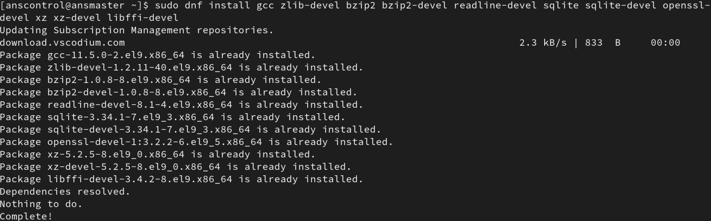
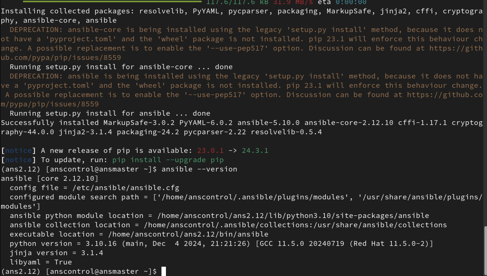

**[Install Specific Versions of Ansible With Virtual Environments - HowTo.md](Install%20Specific%20Versions%20of%20Ansible%20With%20Virtual%20Environments%20-%20HowTo.md)**

last edit: 20241214

#### Things we are covering
- setup an Ansible environment that can work with legacy systems or version specific testing
- determine correct Python / Ansible version pairings
- install and configure pyenv
- install and activate a Python virtual environment for Ansible use
- use pip to install a specific version of Ansible to your virtual environment

There is a list of all the commands at the end of this document. If you just need a refresher just scroll down and zoom through the steps. Look for *Summary For The Impatient (Like Me)*. If you've never done this before then I recommend you read through the entire document just once. Also, references are at the bottom of this doc.

## The Goal
The goal is to install one or more different versions of Ansible and to be able to switch between them.

## Some Reasons You My Need To Do This
If you've been using the default installation that installs from your distro's repositories then you're probably using /etc/ansible as your base of operations. Just a few tweaks of users and permissions you're off and running, right?. There's nothing inherently wrong with that, and if it's working for you then there may be no reason to go the more complicated route below. It just works...until it doesn't.

Let's say your friend started a new job and they found that the company is using Red Hat 6 servers several years after Red Hat discontinued and disavowed that release. And at this new job your friend finds that they are using the basic system installed version of Ansible that just can't talk to the old RH6 systems. The last version of Ansible Core to work with RH6 is 2.12. What could my friend do? The problem with RH6 is that it doesn't have Python 3 available in its repositories and the last version of Python 2 is 2.6.6. The last version of Ansible to work with that version of Python is Ansible Core 2.12.

*\(That's twice that I specifically mentioned **Ansible Core**. Versions and their numbers are kind of a mess in the Ansible world. We'll get that all sorted a bit later.\)*

But your controller node, where your Ansible is installed and where all your playbooks are located, is a nice, up to date Red Hat 9 system with all the latest Python and Ansible updates applied. Nice job keeping that up to date! As you might guess, we are well beyond supporting servers with Python 2.6.6 . There's zero chance that we can easily downgrade our controller to Ansible 2.12.

So, back to RH6. Yes, you can install later versions of Python 2 and even 3, but you'll have to build them and resolve all those library mismatches. The mismatches are going to be a real challenge and it looked too painful for my friend. The other Linux admin's were very nervous about letting my friend loose with gcc, make, and all rest of it. I don't blame them. These are production machines that have to keep limping along until their years-overdo upgrade migrations are complete.

I suggested a different solution. That solution is the use Python virtual environments to install any version of Ansible that will build on the controller node. Ansible is a Python app so building it is pretty much only dependent on having a compatible version of Python 3 installed.

Red Hat 6 isn't the only reason to do this. Using the method outlined below you can install several different combinations to test with whatever scenarios you may run into. Perhaps you have several different divisions of the company and each has their own systems with their own inventories and needs. Maybe your doing a proof of concept for managing your VMware data centers. Do you have developers in your company? Well you'll probably need another setup just for them.

There is a path forward, but only if we can get the matching version of Python 3 installed for our chosen version of Ansible. So what do we do?

Knock, knock! Who's there? Python virtual environments courtesy of pyenv. (sorry, really, please don't leave)

We are going to cover installing pyenv, Python virtual environment support, matching our target version of Ansible to the correct version of Python, then getting them all to work together.

The solution for my friend uses pyenv to setup the correct virtual version of Python 3, then uses that version of Python to install the correct version of Ansible that will talk to the antiquated RH6 servers. It's important to use the right combination of versions of Python and Ansible together. We will cover exactly how to do that based on Ansible's documentation. References are at the bottom of this document.

Finally, this is not the only way to accomplish our objective. You can use Ansible Navigator with containerized versions of Ansible. The libraries and Python version is guaranteed to match and it will be self contained. The downside is that there's no official Ansible container that has a pre-built version 2.12 for my friend. His choices are to either trust a community built container or build his own, neither of which appeal to me.

So let's get started with my chosen way to accomplish our goal. The steps are a little complex, but by the third time you do this the hardest part will be waiting for the building and installing of Python and Ansible.

The last item we'll cover is getting a new version of Linux to talk to an antique system with SSH. Some of the hashing, key exchange, and encryption algorithms that RH6 and other oldies use are no longer considered safe. That means they are disabled by default in new distros. You can test this yourself by trying to ssh from your shiny new system to your dusty old systems. There are some easy enough tweaks to get your connections working. Since Ansible uses SSH by default we'll have to work on this too.

By following the steps below we got my friend's Ansible controller talking to the RH6 servers. They are now managed just like the newer systems. All he has to do is switch to a different virtual environment. It's easy. Tell pyenv to use the necessary versoin of Python then activate the correct Python virtual environment.

## How To - Step By Step
We'll just dig right in and break this into smaller steps that will actually be pretty easy to do. Be sure to follow the steps carefully. There are a few potential gotchas along the way.

First, let's take care of this nasty little business. Do not use root to run Ansible. Create an account for your controller node to use. It may be the same account or a different account than you use on your inventory systems. Only use the *become* directive when absolutely necessary and let sudo do your privelege elevation. It's outside the scope of this document, but if you're not sure how to get started with a key based, non-root deployment please reach out to me. I'll help you get jump started. I die a little inside every time I find a sloppy, root only deployment. It's poor security hygiene, untrackable through logs, and just undisciplined. Apologies, lecture is over, but I think this is really important.

Our prequisites:
- your controller system needs to have curl installed, it's probably already there but I don't want any surprises later
- create a user account on your controller node - I use the username `anscontrol` and set a nicely complex password, you'll need a home directory too
- generate fresh ssh keys, if you are talking to old servers then it's easiest to stick with rsa, keep the key size to 2048, and hash to SHA-256
- log into that account - you will only need root or sudo priveleges to install the development tools, everything else only uses simple user permissions

### pyenv Installation
Pyenv may be new to you but it's very common among Python developers. There are other ways to switch versions of Python, but I think this is easiest. Even better, it just works.

And now an admission. You can try to get your old versions of Ansible to run with whatever Python 3 is installed on your system. I did get Ansible Core 2.12 to work with Python 3.12. That said, I really think it's a better practice to match your necessary Ansible version to the target version of Python. This is especially true if you're supporting multiple environments or even multiple clients. Pyenv works really well and persists when rebooting. It is my best practice.

I'm using a BASH shell and it's running on a fully patched Red Hat 9.5 system. As long as your system is reasonably up to date and you're using a BASH shell, this is going to go great. Note that you may have slightly different commands and names to get the development tools install. These instructions are geared towards Red Hat/Rocky/Fedora with YUM or DNF. Look at the reference link at the bottom to find specific install instructions for or other distros.

Now we work:
Open a terminal on your control node and login.

Install development tools so that the Python installs will build correctly. **This step requires sudo or root privileges.** It's the last time we'll need root/sudo.  
`sudo dnf install gcc zlib-devel bzip2 bzip2-devel readline-devel sqlite sqlite-devel openssl-devel xz xz-devel libffi-devel`



And yes, I already had mine installed. This at least shows that all the package names are correct for RH9. It's probably right RH8 and RH7.

Now we just run the command to install pyenv. They make this really easy. We use curl to download their installer script and pipe it to BASH. If you want to be a bit nerdy then you can download the script and look it over. You'll find that it just pulls another script and runs that. Have fun, but for now we'll just get the job done.  
`curl https://pyenv.run | bash`


That's pretty easy right? Now we have to deal with this warning.  


Copy and paste the text from that warning into the appropriate file. For most of us we add it to the end of our .bash_profile. Mine looks like this:  


Here's our first important gotcha. Don't just source or exec the shell. Close it. If you're running in a GUI just log out completely. If the tweaks to your .bash_profile aren't working then nothing else from here on will work correctly. Yes, this got me once. Now I just reboot.

Did you get your shell restarted? Type `env` and make sure the pyenv directories are first in your path. Mine looks like this: `PATH=/home/anscontrol/.pyenv/plugins/pyenv-virtualenv/shims:/home/anscontrol/.pyenv/shims:/home/anscontrol/.pyenv/bin:/home/anscontrol/.local/bin:/home/anscontrol/bin:/usr/local/bin:/usr/local/sbin:/usr/bin:/usr/sbin`

Type `pyenv install -l` to make sure it's working. You should get back a really long list of available Python versions. Get this right before moving on. We'll choose the right Python next.

### Choose the Correct Python3/Ansible Combination
Our focus is on installing a verison of Ansible that works with our Red Hat 6 servers. The last version of Ansible Core that works with Red Hat 6 is 2.12 because we are stuck with Pyton 2.6.6 on that server.

Now we need to find the best version of Python 3 to run on our control node to work with Ansible Core 2.12. Go to this link and check out this table, the ever popular ansible-core support matrix.  
[Ansible Core Support Matrix - https://docs.ansible.com/ansible/latest/reference_appendices/release_and_maintenance.html#ansible-core-support-matrix)](https://docs.ansible.com/ansible/latest/reference_appendices/release_and_maintenance.html#ansible-core-support-matrix)


The image shows that for Ansible Core 2.12 the controller node should be using Python 3.8 - 3.10. We are going to choose the last version of **3.10.x**

Now back to Ansible Core version 2.12. Now we need to know which version of Ansible that is. Say what? Right! We're dealing with the annoying mismatch between Ansible Core versus Ansible Community Package version numbers. They are not the same. Ansible Core 2.12 is Ansible 5. Confused? I was, but here's where I look to get it right.  
[Ansible Community Version Matrix - https://docs.ansible.com/ansible/latest/reference_appendices/release_and_maintenance.html#ansible-community-changelogs](https://docs.ansible.com/ansible/latest/reference_appendices/release_and_maintenance.html#ansible-community-changelogs)

Look at that table, the one with Ansible Core versions and community package releases. You'll see that Ansible Core 2.12 corelates to community package 5. We will choose the last **Ansible Community 5.x** version of Ansible Community. This gets a bit messier, but we'll work on this together.

This is the complicated step and we just finished. Let's start installing stuff.

### Install Python 3.10.16
Go back to your shell and run this command again.  
`pyenv install -l`

You will find that version 3.10.16 (near the top of the list) is the final 3.10.x release. Run this command. Be patient.
`pyenv install 3.10.16`

More gotchas to consider. If this runs quickly then your pyenv environment isn't right. Double check the items we added to your .bash_profile, and restart the shell. This is what a proper installation looks like.


Another gotcha is that tkinter warning. It just means that you didn't have Tk/TCL installed before you started the Python build. It is safe to ignore.

Let's see what versions of Python we now have available.  
`pyenv versions`

You'll get back something like this:  
```
* system (set by /home/anscontrol/.pyenv/version)
  3.10.16
```

The asterisk indicates that we are currently using the system Python. Now we switch to our newly installed version like this:  
`pyenv global 3.10.16`

This shows we are now using our preferred version of Python. It will stay this way across reboots until you change it to something else.
```
  system
* 3.10.16 (set by /home/anscontrol/.pyenv/version)
```

The asterisk is now where we want it. Confirm this by executing:  
`python3 --version`

### Ansible Virtual Environment and Setup
I think you'll be surprised how easy this step is. There are only two commands, so you can just do them now and read later. But, the details are important to understand at some point. Ready?

The first thing to understand is that you must set your Python version with Pyenv before you create your virtual environment (venv). Part of the venv process is to create symlinks to whatever your current Python version. It sounds rigid but that is what we want. It sets up a reproducible environment. I ran `pyenv global 3.10.16` before proceeding.

Another thing to understand is that this will create a subdirectory in whatever your current working directory is. I prefer to run this in my home directory and let my subdirectory get created therein.

Also, the name of the directory is completely arbitrary. Since my goal is to install a specific version of Ansible I name the directory with a name that indicates the version. If you need to install multiple copies of the same version of Ansible, or you're setting up virtual environments for other purposes you may want a different naming convention. Just pick something meaningful for you.

In this example I am install Ansible Core 2.12 so I'll name the directory **ans2.12** .

Now run this command (in your home directory):  
`python -m venv ans2.12`

There isn't much feedback. Here's what you end up with.


Let's take a quick look at what got created in the /home/anscontrol/ans2.12/ and the /home/anscontrol/ans2.12/bin/ directories.  


Two things interesting to see in the bin directory. One is that symlinks to the selected pyenv Python version.

The other thing to notice is the the **activate** command. It's a script (for both bash and zsh) that you use to turn your virtual environment on. **It's really important to do this before you install Ansible.** The command is this:
`source ans2.12/bin/activate`

Notice how the prompt changed. This indicates that your venv is active. And yes, you need to use the `source` command because the activate script is not flagged as executable. There is no hash bang/shebang in the script so we're stuck with this. It's not so hard, right?


A final note about the virtual environment. When you are done with it just type `deactivate` to turn it of. It's a command that runs from anywhere, no source needed. Notice that your prompt reverted back to the default. But don't deactivate it yet; we have work to do.

### Install Our Desired Version of Ansible
Be sure you have set your version of Python with pyenv, and then activated your virtual environment for Ansible. This is really important because we are not installed a pre-packaged Ansible with Yum/DNF, Apt, or Zypper. We are causing Ansible to be downloaded and built on demand. This is also where we work at installing the right version of Ansible even when the version numbers are kind of a mess. We'll use our earlier reseach to zero in on the necessary version.

A special note about pip. Pip has changed a number of times over the years. The way you list available packages has also changed. The instructions just below worked for my default (older < 9) version of pip. You may see a message that you should upgrade, and that's no problem except how you list available packages could be drasticly different. Here's a really brief summary from someone else's testing (reference at the bottom of this page):
- your version < 9.0 `pip install ansible==asdf` using any string to cause the listing to appear (confirmed by me)
- your version >= 9.0 `pip install ansible==` just the double equal sign should cause the listing
- your version >= 20.3 `pip install --use-deprecated=legacy-resolver ansible==` a clunky legacy flag
- your version >= 21.1 `pip install ansible==` right! back to this one
- your version >= 21.2 `pip index versions ansible` works but has a warning about being experimental (confirmed by me on pip 24.3.1)

What we did is cause the pip installer to dump out a list of every version of Ansible that's available to download.


This really demonstrates the tangled mess of available versions. The latest version of Ansible Core as of this writing is 2.18. All those version numbers above that are the full Ansible Community version. Also notice that there is no 2.12 version available in that list. Since we already know that the community version 5 correlates to the 2.12 core version we have a solid way to make a choice. I am choosing the highest 5.x version available.

Now we do the actual install:
`pip install ansible==5.10.0`

While we're waiting I will mention that there is a slightly different command that only installs the core. The catch is that you may only use core version numbers. `pip install ansible-core==x.xx.x`. I see no reason to limit ourselves with this twiddly version of the command.

Still building? That's perfectly normal. This takes several minutes. Since we're installing an older version it's OK to see some deprecation warnings. And then it's done (probably with a nag to update pip that we don't really care about).



We see that the build completed without error and we see that we are running version 2.12. Also notice that it's pointed to the wrong ansible.cfg. That's the default location when Ansible can't find anything else. We just have a little configuration to do.

### A Brief Test
You'll need to create an ansible.cfg file and an inventory file to get started. There's a link in the references that explains where and the precendce that Ansible uses to look for config files. I'm going to copy in a config file and an inventory that I already use in this environment. Here's my first test.


And we have one little problem. Can you guess which host runs Red Hat/CentOS 6? That's right. It's the one to which we cannot connect with ssh...yet. This is the problem I mentioned at the beginning. I know this system will work with Ansible 2.12, and it will connect to our controller system. Look in the references for a really good page that explains all the things you may need to do to get your current systems to ssh to legacy systems. It does require a Red Hat account to see it, but all you need to do is sign up for a free developer account.

Here was my work around. Your mileage may vary.
As root I ran this `update-crypto-policies --set DEFAULT:SHA1` and then rebooted. Then I used ssh to log into the RH6 system and accepted the fingerprint. And finally I deployed an Ansible user and keys. Now Ansible can access the RH 6 host.

This is what it looks like when I ping all my Unix and Linux hosts in my lab:


And take note of the one host that's warning us about using a deprecated version of Python 2. That's why we did this, so that we can access and automate my friends legacy RH6 servers. My friend is really bummed out though. He found a Red Hat 5 server running in production. That one is so old that it's just out of reach. But seriously, who still has RH5 in production? (Supposedly Ansible 2.3 with Python 2.6 would work. But, seriously?)

#### Summary For The Impatient (Like Me)
- `sudo dnf install gcc zlib-devel bzip2 bzip2-devel readline-devel sqlite sqlite-devel openssl-devel xz xz-devel libffi-devel`
- `curl https://pyenv.run | bash`
- Paste the shell tweaks to the end of your .bash_profile file then restart your shell. Rebooting guarantees success.
- `pyenv install 3.10.16`
- `pyenv global 3.10.16`
- `python -m venv ans2.12`
- `source ans2.12/bin/activate`
- `pip install ansible==5.10.0` (wrong syntax? see the pip reference link just below)

And that's it. I hope you found this useful.

#### references
[Intro to Pyenv](https://realpython.com/intro-to-pyenv/)  
[Various version dependant pip search options](https://stackoverflow.com/questions/4888027/how-to-list-all-available-package-versions-with-pip)
[Ansible Config File Locations](https://docs.ansible.com/ansible/latest/reference_appendices/config.html)  
[SSH Connections To Legacy Systems](https://access.redhat.com/solutions/7012231)  
[Red Hat 5 - Please Don't](https://www.redhat.com/en/blog/using-ansible-to-manage-rhel-5-yesterday-today-and-tomorrow)  
